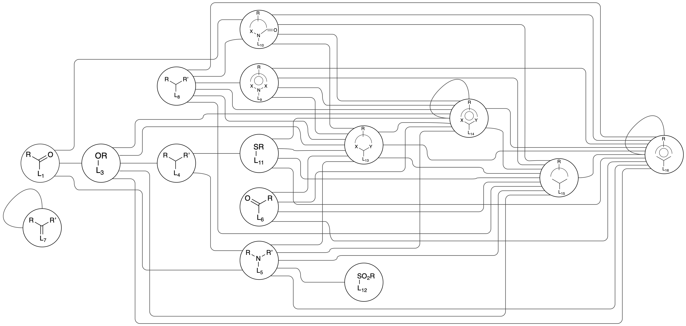

GA data for `Design of Recyclable Plastics with Machine Learning and Genetic Algorithm`

- The hypothetical polymers generated using the GA are separated into 6 spreadsheets labeled `split_i.csv` where i ranges from 1 to 6.

- rgroups.csv contains the list of R-groups used in the GA. Each rgroup has a single dummy atom. The atom adjacent this dummy atom bonds to the atoms adjacent the dummy atoms in the scaffolds.

- scaffolds.csv contains the list of scaffolds for the GA. For each run of the GA, we used scaffolds with the same values in the `class` column. We selected scaffolds with 1 or 2 `num_stars`,
selecting the four or five scaffolds with the highest `count` column value. These counts were extracted by searching a list of molecules with the appropriate ring structure and then seeing
which bond locations were most common among them. E.g., the molecule `C1C(C)COC(=O)1` would have scaffold `C1C([*:1])COC(=O)1`. `smiles` is the output from using RDKit to extract these scaffolds,
and `fixed_smiles` simply converts `[1*]` or `[2*]` to `[*:1]` or `[*:2]` which is necessary for the GA. Ring sizes tell you the size of the ring in the scaffold. See [Scaffold Generation](#scaffold-and-fragment-generation) for the code used to generate these.

- reaction_procedures.json contains the list of reaction procedures defined using [reaction SMARTS](https://www.daylight.com/dayhtml/doc/theory/theory.smarts.html). Note that `[Ge]` is used as a dummy atom to allow us to open the rings into polymer form regardless of the ring size or structure.

- `split_i.csv` has the following columns:
    - `monomer_smiles`: the monomer smiles
    - `polymer_smiles`: canonical version of the polymer smiles found using [this package](https://github.com/Ramprasad-Group/canonicalize_psmiles)
    - `rop_class`: what reaction pathway was used. All scaffolds that can undergo a specific reaction are used in one run of the GA. E.g., all ROMP scaffolds are run together
    - `run_name`: Each `rop_class` was run three times. This notes which of the three runs the polymer was found in.
    - `generation`: The generation in which the polymer was created.
    - `property(unit)`: These are six columns representing predicted properties. They include glass transition temperature (Tg), decomposition temperature (Td), heat capacity (Cp), Tensile strength at break (TSb), Youngs modulus (YM), and enthalpy of polymerization (enthalpy)
    - `sa_score`: The synthetic accessibility score of the designed monomers
    - `scaffold`: Which scffold was used to generate the polymer
    - `1`: Which R-group was bound to position one in the scaffold
    - `2`: Which R-group was bound to position two in the scaffold


## Scaffold and Fragment Generation

To generate the scaffolds and fragments, we used the following code:

```Python
from rdkit import Chem
from rdkit.Chem.BRICS import BRICSDecompose
from collections import defaultdict

df = pd.read_csv('your_list_of_molecules.csv')

fragments = set()
clean_molecule = set()
scaffolds = defaultdict(list)
# In this case, I am searching for all five member lactones in my list of molecules
pattern = Chem.MolFromSmarts('C1CCOC(=O)1')
for index, row in df.iterrows():
    print(f"{index}/{len(df)}", end='\r')
    mol = Chem.MolFromSmiles(row['smiles'])
    Chem.RemoveStereochemistry(mol)
    # Remove explicit hydrogens
    mol = Chem.RemoveHs(mol)
    if not mol.HasSubstructMatch(pattern):
        continue
    smiles = Chem.CanonSmiles(Chem.MolToSmiles(mol))
    if smiles in clean_molecule:
        continue
    clean_molecule.add(smiles)
    scaf = Chem.MolToSmiles(Chem.ReplaceSidechains(mol, pattern))
    scaf = re.sub('\[(\d+)\*\]', '[*]', scaf)
    scaffolds[scaf].append(index)
    frags = BRICSDecompose(mol)
    for f in frags:
        fragments.add(f)
print()

data = []
for k, v in subs.items():
    data.append({'scaffold': k, 'count': len(v)})
scaffold_df = pd.DataFrame(data)
scaffold_df = scaffolds.sort_values(by='count', ascending=False).reset_index(drop=True)
```

First, we're loading rdkit and our data. 

```Python
from rdkit import Chem
from rdkit.Chem.BRICS import BRICSDecompose
from collections import defaultdict

df = pd.read_csv('your_list_of_molecules.csv')
```

Next, we're creating some sets and dicts to store our fragments, scaffolds, and to ensure we don't assess the same molecule twice we're going to keep the set of cleaned molecules we've seen before. Then, we assess the pattern we want to find scaffolds for. In this case, I want to create scaffolds for a five member lactone ring.

```Python
fragments = set()
clean_molecule = set()
scaffolds = defaultdict(list)
# In this case, I am searching for all five member lactones in my list of molecules
pattern = Chem.MolFromSmarts('C1CCOC(=O)1')
```

Here, I iterate through my molecular structure list (assuming it has a smiles column) to identify matching scaffolds. For each molecule:

1. I clean the structure by removing explicit hydrogens.
2. If the molecule lacks the target pattern or has been previously encountered, I skip it.
3. Otherwise, I add it to the "seen" list.
4. Using ReplaceSidechains, I extract the scaffold by removing sidechains and replacing them with dummy atoms ([#*]).
5. I remove the arbitrary dummy atom numbers.
6. The scaffold's polymer index is appended to the corresponding dictionary list, facilitating analysis of molecules sharing this scaffold.
7. Finally, BRICS decomposition is applied to identify viable molecular fragments.
```Python
for index, row in df.iterrows():
    print(f"{index}/{len(df)}", end='\r')
    mol = Chem.MolFromSmiles(row['smiles'])
    Chem.RemoveStereochemistry(mol)
    # Remove explicit hydrogens
    mol = Chem.RemoveHs(mol)
    if not mol.HasSubstructMatch(pattern):
        continue
    smiles = Chem.CanonSmiles(Chem.MolToSmiles(mol))
    if smiles in clean_molecule:
        continue
    clean_molecule.add(smiles)
    scaf = Chem.MolToSmiles(Chem.ReplaceSidechains(mol, pattern))
    scaf = re.sub('\[(\d+)\*\]', '[*]', scaf)
    scaffolds[scaf].append(index)
    frags = BRICSDecompose(mol)
    for f in frags:
        fragments.add(f)
```

Finally, we can keep track of the scaffolds and their count in a dataframe.
```Python
data = []
for k, v in subs.items():
    data.append({'scaffold': k, 'count': len(v)})
scaffold_df = pd.DataFrame(data)
scaffold_df = scaffolds.sort_values(by='count', ascending=False).reset_index(drop=True)
```

To create the R-groups now, you can just select all fragments that have a single joint and that have the to connect to the specific scaffold BRICS number. For a lactone this would be either L15 or L13, so any number linking to those would work. See the below schematic for groupings (figure modified from the [original paper](https://chemistry-europe.onlinelibrary.wiley.com/doi/10.1002/cmdc.200800178))

