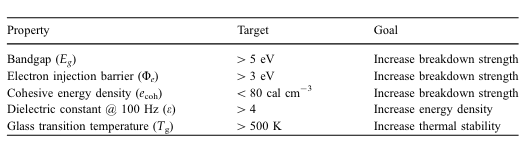

The data is provided along with the following paper:

J. Kern, L. Chen, C. Kim, and R. Ramprasad, “Design of polymers for energy storage capacitors using machine learning and evolutionary algorithms,” J Mater Sci, Sep. 2021, doi: 10.1007/s10853-021-06520-x.

There are two files

- The spreadsheet `GA Predicted Hypothetical Polymers.xlsx` presents hypothetical polymers alongside predicted properties, as illustrated in the attached image:  
    - It features columns `predicted_reactant1, predicted_reactant2, synthesizability_score, polymerization_class, hypothetical_polymer`. These fields denote the proposed reactants, the likelihood of synthesizability (ranging from 0 for least likely to 1 for most likely), the recommended polymerization reaction, and the SMILES representation of the hypothetical polymer.
- `bonds.xlsx` is a spreadsheet designed for use with the genetic algorithm, featuring two columns: `desired_links` and `undesired_links`. These columns are populated with specific chemical SMARTS, indicating the preferred and avoided bonding patterns, respectively.

